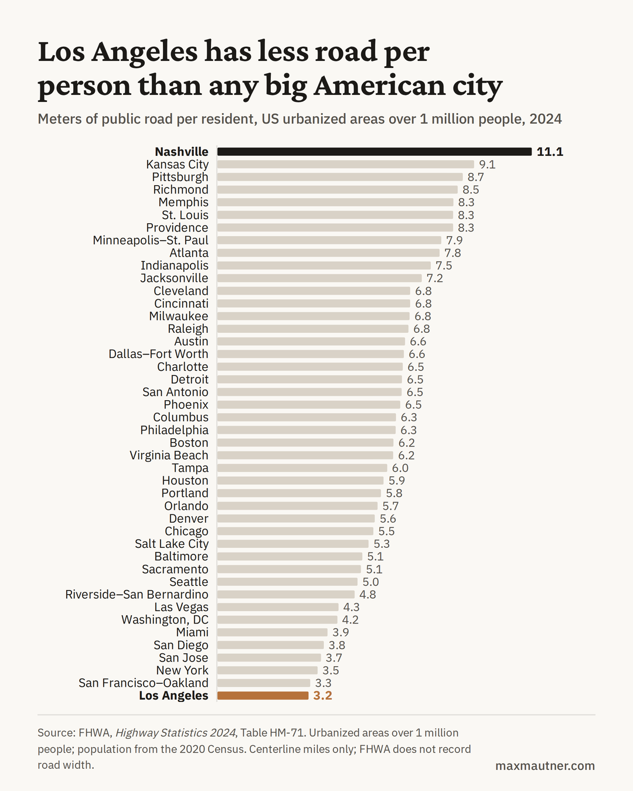

# Road per resident in US metro areas

Data and code behind the maxmautner.com post *Too many roads*, whose lead chart shows that Los Angeles has less public road per resident than any other US urbanized area over 1 million people.



## Source

Every number comes from one federal table:

FHWA, *Highway Statistics 2024*, Table HM-71, "Urbanized Areas: Miles and Daily Vehicle-Miles Traveled" (January 22, 2026).
https://www.fhwa.dot.gov/policyinformation/statistics/2024/hm71.cfm (PDF and Excel versions linked there)

*Highway Statistics* is FHWA's annual compilation of the data states submit through the Highway Performance Monitoring System (HPMS), the federal inventory used to apportion federal-aid highway funds. For each Federal-Aid Urbanized Area, HM-71 reports the 2020 Census population, 2024 public road miles by functional class with a total, and 2024 daily vehicle-miles traveled (DVMT, in thousands) by functional class with a total.

### Why the 2024 edition and not 2023

The first version of this analysis used the 2023 edition. Its population column is the **2010** Census count for 2010-vintage urbanized areas (New York--Newark: 18,351,295, the same figure printed in the 2019, 2020, 2021 and 2023 editions), set against 2023 road miles. The 2024 edition is the first to use 2020 Census urbanized areas and their 2020 populations (New York--Jersey City--Newark: 19,426,449), so its population and road figures describe matching areas. The 2023-edition results are kept in `data/archive/` for comparison.

Los Angeles has the least road per resident in both editions (3.30 m in 2023, 3.22 m in 2024). The switch mainly lowers fast-growing Sun Belt metros, whose 2010 populations understated how many people share their roads: Atlanta falls from 9.05 to 7.85 m, Jacksonville from 9.01 to 7.22 m, Austin from 8.23 to 6.63 m.

## Method

1. Take every urbanized area with a 2020 population of at least 1,000,000, excluding Puerto Rico. That yields 44 areas.
2. From each, use three published figures: population, total road miles, and total daily vehicle-miles.
3. Compute:

| Metric | Formula |
|---|---|
| Meters of road per resident | total miles × 1,609.344 ÷ population |
| Residents per mile of road | population ÷ total miles |
| Daily vehicle-miles per road mile | DVMT × 1,000 ÷ total miles |
| Daily vehicle-miles per resident | DVMT × 1,000 ÷ population |

The regional aggregates (`data/regional-aggregates-2024.csv`) add up the separately reported urbanized areas that make up greater Southern California (11 areas) and the Bay Area (12 areas), because the Census splits outlying suburbs such as Santa Clarita and Concord from the core areas. The member lists are in `scripts/build_metrics.py`.

A hand check for any row: Los Angeles--Long Beach--Anaheim has 12,237,376 residents and 24,451 miles of road. 24,451 × 1,609.344 ÷ 12,237,376 = 3.22 meters per resident.

## Cross-checks

- **Arithmetic inside the table.** Every row's functional-class columns sum to its published total, and the rows sum to the table's TOTAL row. `parse_hm71.py` verifies both.
- **Two editions, two Censuses.** The bottom of the ranking (Los Angeles, San Francisco--Oakland, New York, San Jose, San Diego) is the same in the 2023 edition (2010 areas and populations) and the 2024 edition (2020 areas and populations).
- **An independent source.** The City of Los Angeles reports about 6,500 centerline miles of city streets for roughly 3.9 million residents, about 2.7 meters per resident. HM-71's 3.22 m for the whole urbanized area is consistent: it also counts freeways, state highways, and the other cities in the area.

## Reproduce

```
pip install -r requirements.txt
playwright install chromium     # only for the charts
make
```

or step by step:

```
python scripts/fetch_hm71.py        # download the PDF to data/raw/, print its SHA-256
python scripts/parse_hm71.py        # every row of the table -> data/hm71_2024_all_areas.csv
python scripts/build_metrics.py     # -> data/us-metro-road-per-resident-2024.csv, data/regional-aggregates-2024.csv
python scripts/render_charts.py     # -> charts/*.png
```

`parse_hm71.py` checks its own extraction two ways: each row's functional-class columns must sum to that row's published total, and the sum of all parsed rows must match the table's own TOTAL row (population exactly, other columns within accumulated rounding). If a row is dropped or split during PDF extraction, the second check fails.

`data/reference/hm71_2024_rows_used.txt` is the text of every HM-71 row this analysis uses, as extracted from the PDF. `python scripts/parse_hm71.py data/reference/hm71_2024_rows_used.txt` followed by `python scripts/build_metrics.py` reproduces the published CSVs without downloading anything.

## Caveats

- **Boundaries.** A Federal-Aid Urbanized Area "at a minimum encompasses" the Census urbanized area; states may draw it larger to smooth the edges, so road miles can cover somewhat more land than the population count does. How much varies by state and is not published in this table. This biases every area's road per resident upward, by amounts that differ from area to area.
- **Width.** Miles are centerline miles. FHWA does not record road width and assumes two lanes for all local streets, so neither pavement area nor true lane-miles can be computed from this table.
- **Local roads.** Local-road mileage and travel are reported by states on a summary basis and are the least carefully inventoried categories. FHWA notes that urbanized areas or data "may be missing or unreported in some States." Differences of a few tenths of a meter in the middle of the ranking are within the noise. The extremes are not.
- **Travel.** DVMT counts all travel on an area's roads, including through traffic, not only trips by residents.
- **Exurbs.** Census urbanized-area boundaries follow housing density, so the lowest-density exurbs of each metro fall outside them.

## Licenses

Code: MIT (see `LICENSE`). FHWA data is a US government work in the public domain. Fonts in `fonts/` (Crimson Pro, IBM Plex Sans) are under the SIL Open Font License; license texts are included.
